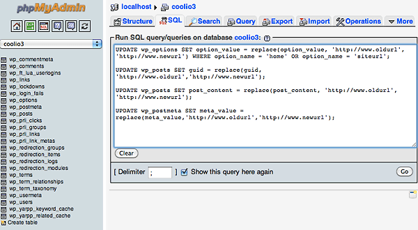

# Cambiar y actualizar las URL de WordPress en la base de datos cuando el sitio se mueve a un nuevo host



Después de migrar un sitio de WordPress a una nueva URL, ya sea a un sitio de producción en vivo o un servidor de desarrollo de prueba, las nuevas cadenas de URL en la base dedatos MySQL deben cambiarse y actualizarse en las distintas  tablas de la base de datos MySQL .

``` sql
UPDATE wp_options SET option_value = replace(option_value, 'http://olddomain.com', 'http://newdomain') WHERE option_name = 'home' OR option_name = 'siteurl';

UPDATE wp_posts SET guid = replace(guid, 'http://olddomain.com','http://newdomain');

UPDATE wp_posts SET post_content = replace(post_content, 'http://olddomain.com', 'http://newdomain');

UPDATE wp_postmeta SET meta_value = replace(meta_value,'http://olddomain.com','http://newdomain');
```

Finalmente, actualice su archivo de configuración de WordPress para reflejar la nueva base de datos, wp-config.php ”, que debería estar en la raíz de su documento web: cambio , nombre de la base de datos ,  nombre de usuario ,  contraseña y valores de host :

```php
define ('DB_NAME', 'databasename'); 
/ ** Nombre de usuario de la base de datos MySQL * / 
define ('DB_USER', 'nombre de usuario'); 
/ ** Contraseña de la base de datos MySQL * / 
define ('DB_PASSWORD', 'contraseña'); 
/ ** Nombre de host MySQL * / define ('DB_HOST', 'localhost');
```